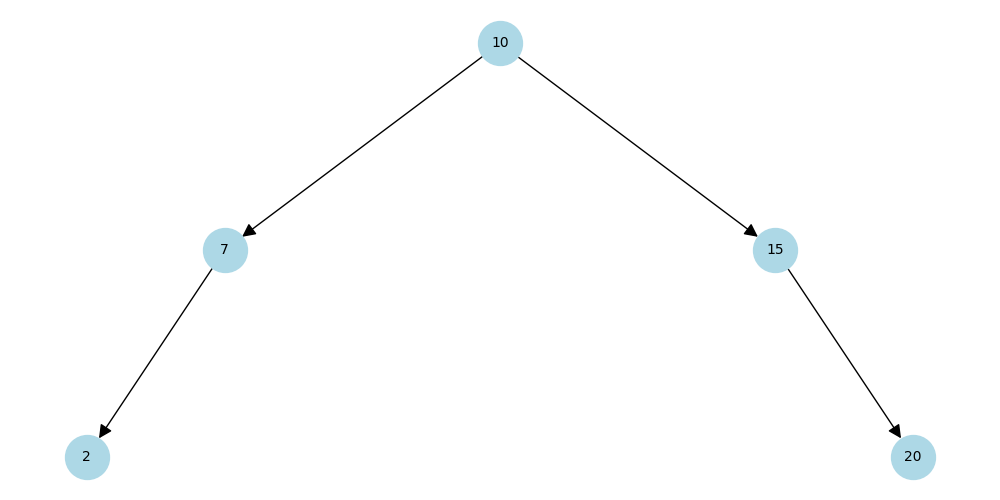

# 🌳 Estrutura de Dados: Árvore AVL com Visualização e Desempenho

Este repositório contém a implementação de uma **Árvore AVL (Adelson-Velsky and Landis)** — árvore binária de busca auto-balanceada — em Python.

O projeto foi feito com foco em:
- Aprendizado de estruturas de dados
- Visualização gráfica com `matplotlib` e `networkx`
- Medição de desempenho com `timeit`

---

📚 Estrutura do Projeto

├── arvore_avl.py        # Código principal com a classe da árvore e testes
├── exemplo_arvore.png   # Exemplo de visualização
└── README.md            # Este arquivo

---

## 🔧 Funcionalidades

- ✅ Inserção balanceada de nós
- ✅ Remoção com rebalanceamento
- ✅ Busca eficiente (`O(log n)`)
- ✅ Impressão em ordem e em formato de árvore
- ✅ Geração de gráfico visual da árvore
- ✅ Medição de desempenho de inserções/remoções
- ✅ Código comentado

---

## 📌 Conceito: O que é uma Árvore AVL?

A **AVL Tree** é uma árvore binária de busca que **se autoequilibra** após cada inserção ou remoção.  
Ela garante que a altura da árvore permaneça em `O(log n)`, evitando degeneração em lista encadeada.

É uma árvore de busca com a garantia de que a diferença de altura entre as subárvores esquerda e direita de qualquer nó nunca será maior que 1. Para manter esse balanceamento, a árvore realiza **rotações** (simples e duplas) sempre que necessário após inserções ou remoções.
---

## 📸 Exemplo de Visualização



---

📊 Medição de Desempenho
O código mede tempo de execução de:
Inserção de 1000 valores aleatórios únicos
Remoção de 200 valores aleatórios
Utiliza a biblioteca timeit para precisão.

--- MEDINDO DESEMPENHO ---
Tempo de inserção de 1000 valores: 0.023234 segundos
Tempo de remoção de 200 valores: 0.004394 segundos
Altura final da árvore: 11

---

## 🚀 Como Executar

```bash
# Clone o repositório
git clone https://github.com/HuinaGabriela/arvore-avl.git
cd arvore-avl

# (Opcional) Crie e ative um ambiente virtual
python -m venv venv
source venv/bin/activate  # ou venv\Scripts\activate no Windows

# Instale as dependências
pip install matplotlib networkx
